<!-- Dependencies -->

# Hand load 185gr Juggernaut

### Summary
Initial load testing of 185gr Berger Juggernauts with VihtaVuori N150. Used VihtaVuori reloading data
https://www.vihtavuori.com/reloading-data/rifle-reloading/?cartridge=30 to sample. 

This is a new powder for me, so testing low charge weights initially to see how it groups.

### Initial Load

<!-- Table container -->

**Special notes:** The COAL below is greater than VihtaVuori's load data of 2.795". Max charge from VihtaVuori data is 40.6gr, but I tested to 41gr.

There were no pressure signs observed, and there is still plenty of case capacity. More testing is needed since velocity is not where I'd like (looking for ~2750fps or greater).

Testing performed at 200 yards with 0 minutes of windage.

### Estimates of initial charges using Gordons Reloading Tool

### Initial charges - actual results 

### Raw data

#
<!-- Table container -->

Initial load testing grouped well, with some low SD/ES numbers in places. Comparing to Gordons Reloading Tool, real numbers appear to be ~30fps slower on average. Velocity is not high enough for me to be happy at 1000 yards, so will next perform a single shot ladder test to determine velocity nodes and max pressure.

### Berger example ballistics data

|    **Bullet Diameter**    | 0.308 inches |    **Zero Range**   |    100 yards   |
|:-------------------------:|:------------:|:-------------------:|:--------------:|
|     **Bullet Weight**     |  185 grains  |   **Sight Height**  |     1.50 in    |
| **Ballistic Coefficient** |     0.284    | **Muzzle Velocity** |    2750 fps    |
|      **Temperature**      |     59 F     |    **Wind Speed**   |    0.00 mph    |
|        **Altitude**       |    0 feet    |  **Wind Direction** |    9 o'clock   |
|      **Inclination**      |   0 degrees  |  **Berger Bullets** | Copyright 2013 |

<!-- Table container -->

Goal is for projectile to be above transonic speeds (1340-890fps) at 1000 yards for the best chance of a good group.

### Estimates of ladder charges using Gordons Reloading Tool

The estimates below will sill not yield the FPS I am looking for. We'll likely be lower than this with the chronograph based on our average of 30fps less from initial testing.

### Ladder testing

The VihtaVuori load data appears to be quite conservative maxing out at 40.6 which averages 2530fps. This doesn't yield enough velocity for FTR shooting for me to be comfortable. I decided to seat the bullet longer (ogive 0.005" off the lands) which allows for much more case fill.

I ran all the way up to 44.4gr excepting to see pressure signs before then. There was a small amount of room left in the case - I do not want to compress loads. 

No pressure signs were observed throughout all the testing, surprisingly. Ambient temperature was ~28°C with two minutes of pause left between each round.

All shots were aimed at dead centre with no modifications or allowances made to elevation or windage throughout.

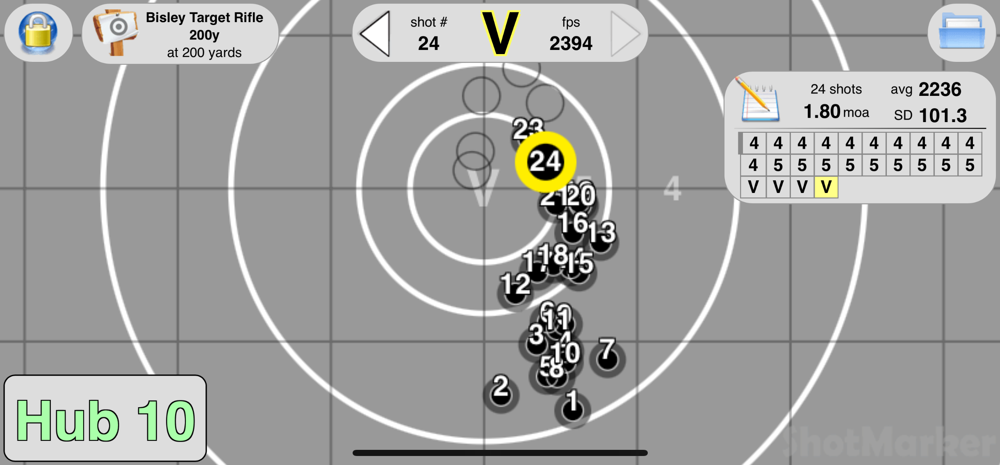

Showing cases after firing. No pressure signs were observed throughout this test. Cases and primers look same all the way through from lowest to highest charge.

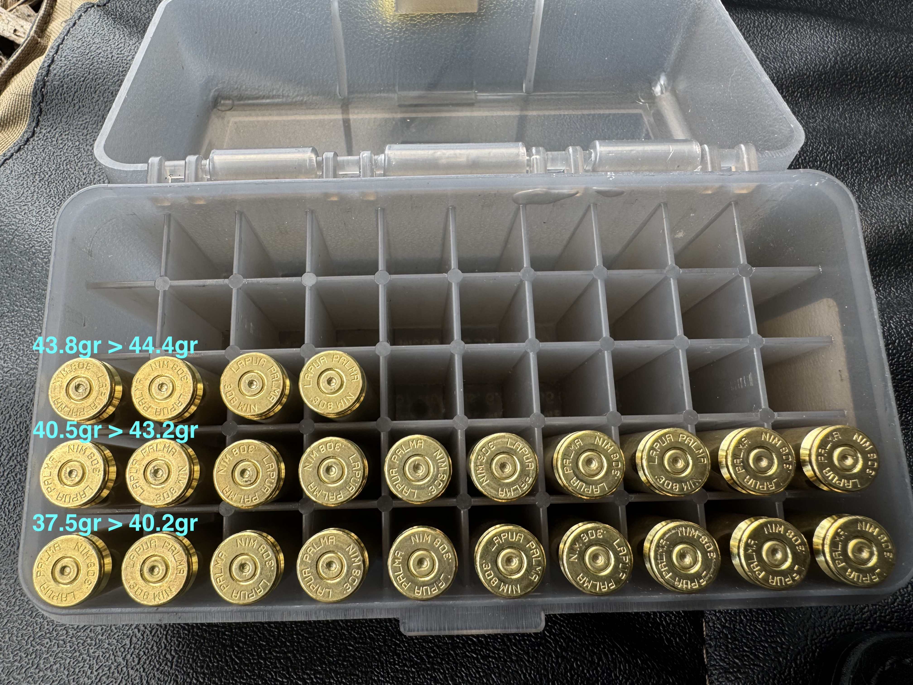

### Final charges - actual results

#### 10 shot tests - raw data

During this range trip, I loaded 10 rounds of 44.1gr, 44.4gr, 44.6gr and 44.8gr. No pressure signs were observed again. These strings were shot at 200 yards again. All shots were aimed dead centre target, with no allowances made for wind. This trip had wind gusts of up to 20mph.

#
<!-- Table container -->

44.1 grains. 0.62 MOA group. Unfortunately, I didn't grab a screenshot of this.

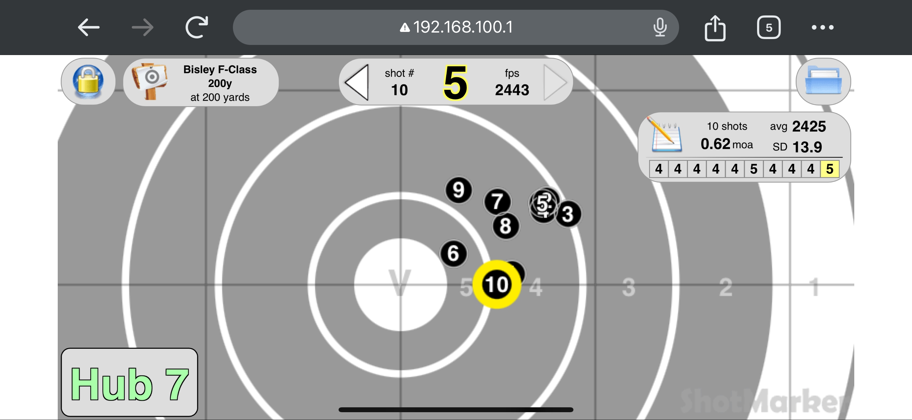
44.4 grains. 0.62 MOA group

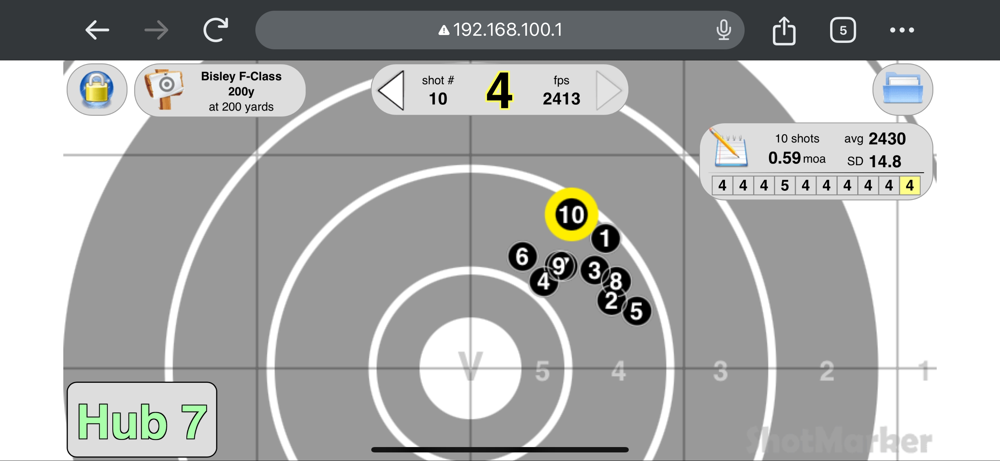
44.6 grains. 0.59 MOA group

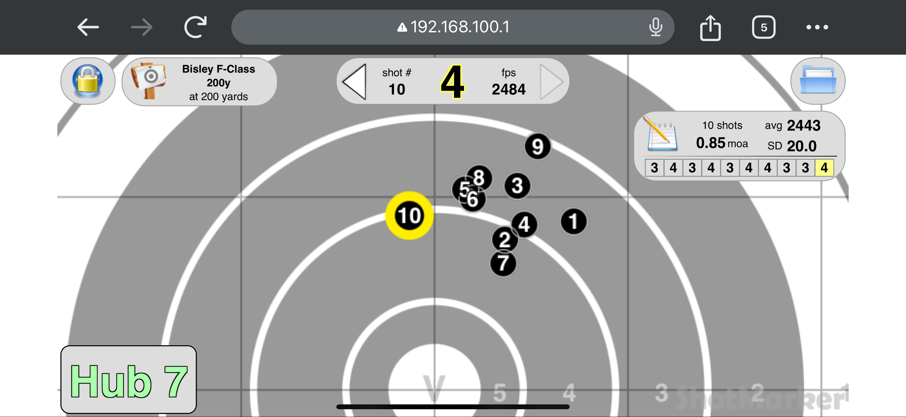
44.8 grains. 0.85 MOA group

### Max Pressure testing

I wanted to see how much more velocity I could achieve here. I wasn't far off max case fill, so I pushed it till I saw pressure signs, without compressing the powder.

I recently changed my bipod to a Seb Joypod-X, which gives me a much better, stable position. I wanted to discount some of the movement in my previous tests to poor positioning.

As previous, these were aimed dead centre, and not making any allowance for wind.

-
<!-- Table container -->

I received a heavy bolt on 45.4 grains and it grouped terribly even in just these three shots.

44.6 grains still looks like a good contender, but 45 grains also looks like it should receive some more testing with its group not being much more than 44.6, but also receiving a better SD and ES.

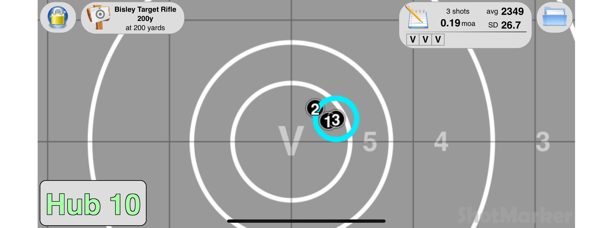
44.6 grains. 0.19 MOA group

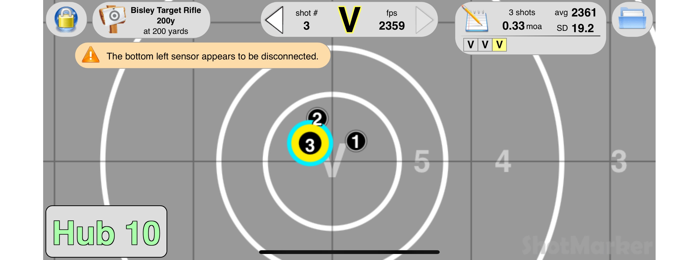
44.8 grains. 0.33 MOA group

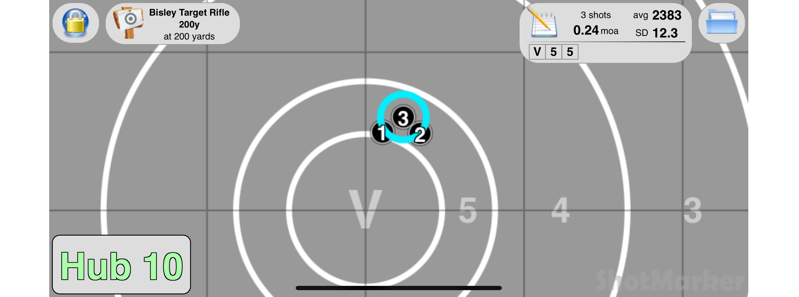
45 grains. 0.24 MOA group

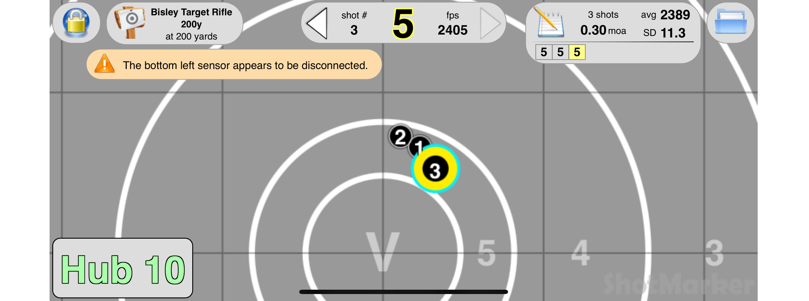
45.2 grains. 0.3 MOA group

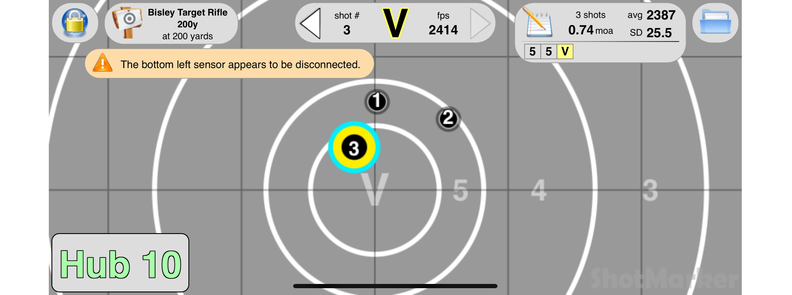
45.4 grains. 0.74 MOA group

I'll load up 10-15 rounds of 44.6 and 45 grains to do a better assessment.

### Match results

Using 44.6gr seems to be a really nice load for up to 600 yards. I won the FTR 300 yard match at the Imperial Meeting 2025:

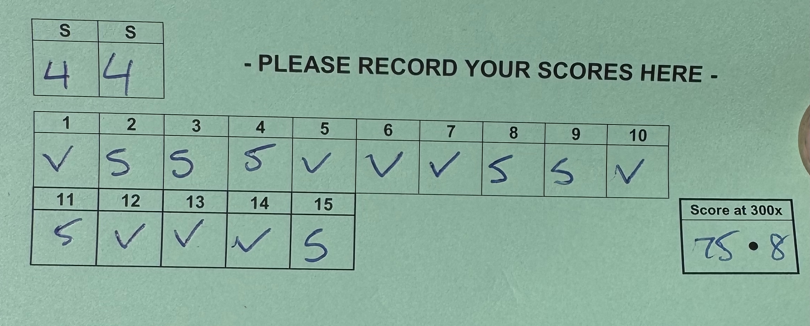

Also club match out to 600 yards yielded a 50.6:
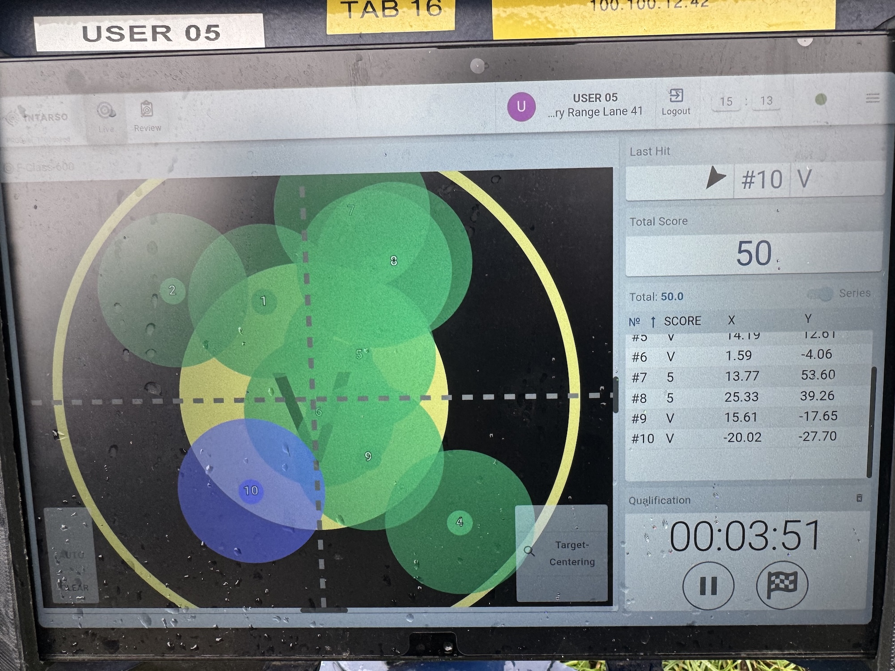
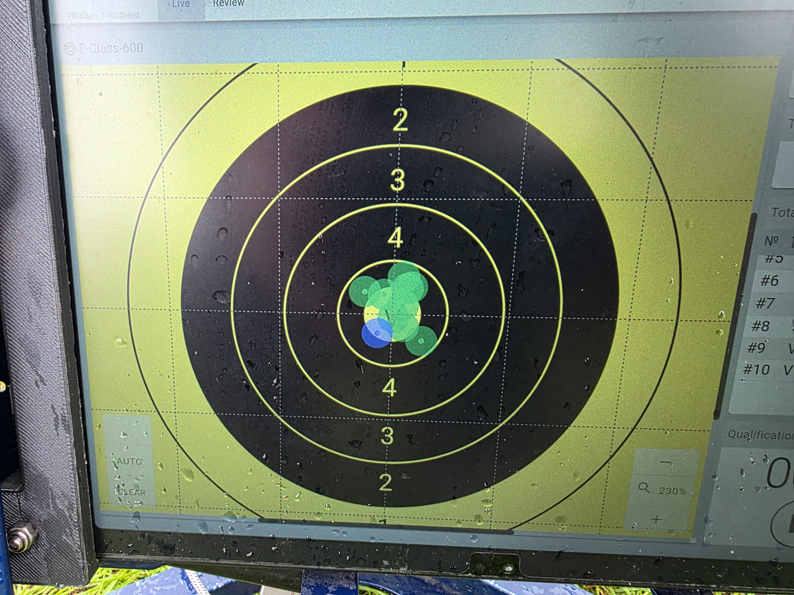

#
### Once fired brass
Initial testing of once fired brass. Bumped back .002" and still with a 2.2850" CBTO.

I did have a two flyers througout this testing, so I will need to go back and verify. Since there were only two flyers, I have decided to discount these since they were way off.

-
<!-- Table container -->

Unfortunately, these groups were shot at 300 yards, instead of 200 yards. Therefore, it is difficult to get an accurate representation on any improvements.

Average velocity appears to have increased ~20fps between new and once fired brass. My previous "winning" load was 44.6gr, and this now appears to be 44.4gr, based on group size, if I discount the flyer on this test. My previous best group with 44.6 was 0.59 MOA at 200 yards (1.2357"), and my new best so far is 0.13 MOA (0.4084"). Initially, this appears to be a drastic improvement!

No pressure signs were observed throughout this test.

#### Screenshots

43.8gr showed promise, despite the flyer. Discounting this resulted in a sub quarter MOA group. Based on the vertical spread, I suspect the flyer to the left was the wind - keeping the same aim point at 300 yards will show this.
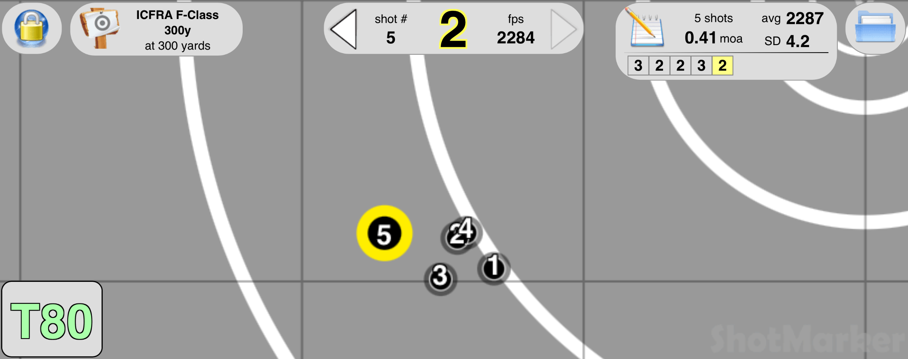
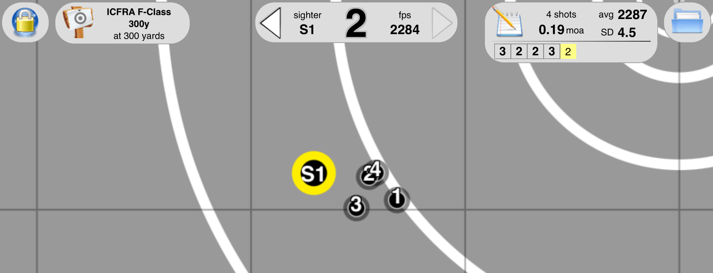

44gr was ok, nothing great. A bit more vertical spread than I'd like.
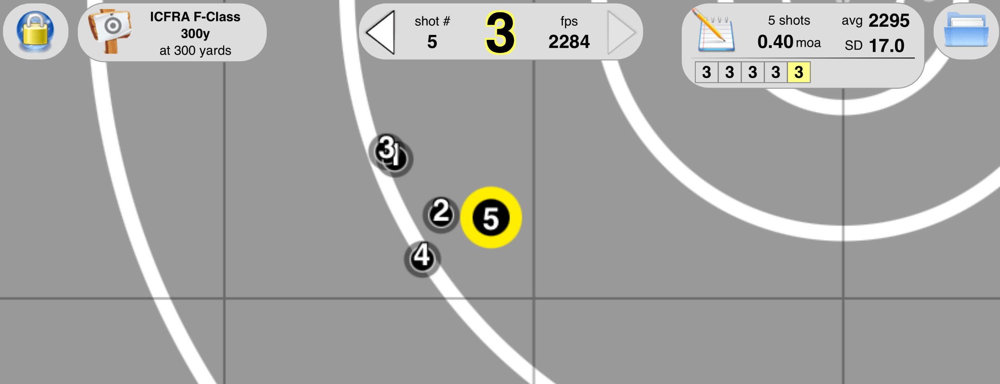

44.2gr an ok group. Nothing fantastic, but nothing to complain about here. Reasonable amount of vertical though.
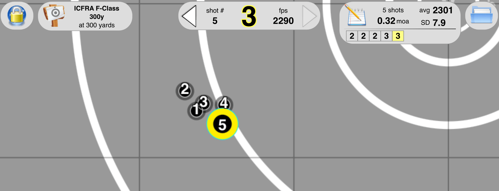

44.4gr was another good group - I suspect the flyer was the wind based on the elevation being relatively consistent. Both groups shown with and without the flyer below.
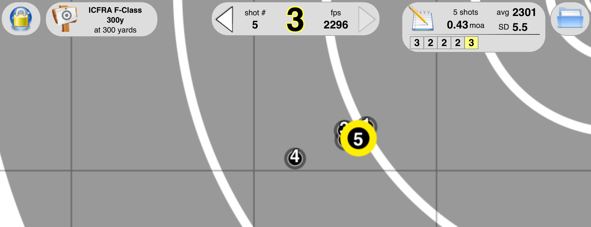
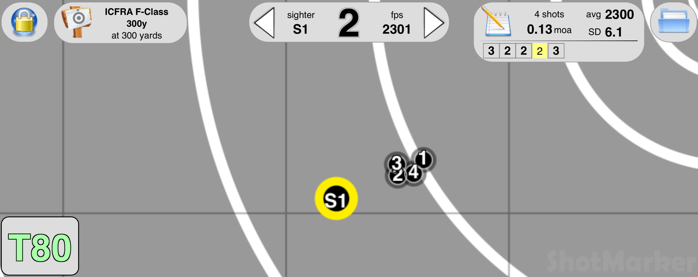

44.6gr opened up a little on the vertical. Discounting shot 5, we'd be roughly quarter MOA.
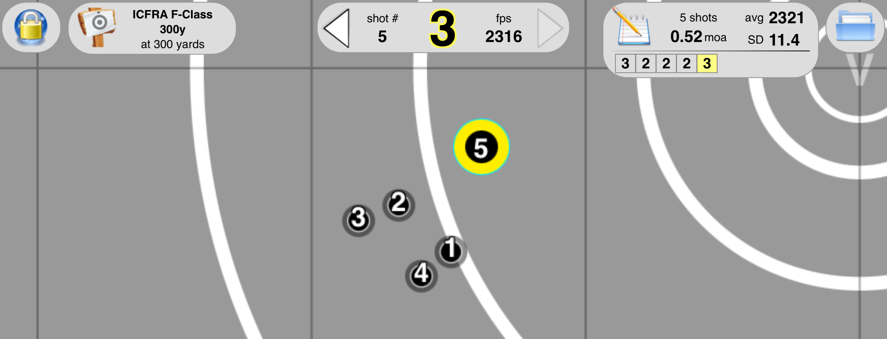

Based on this, the groups have definitely improved over new brass. Will need to repeat the tests again to get some extra validation. It would appear that my previous 44.4gr and 44.6gr charge weights can remain. I'd also like to work up to 45gr to see if the node continues.