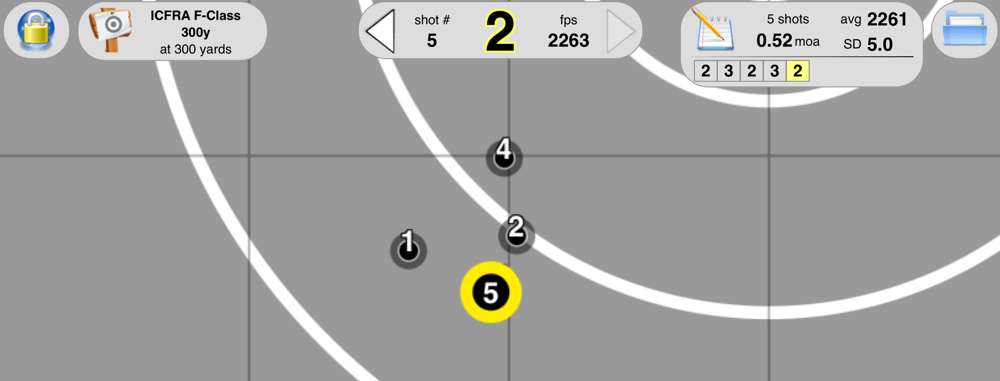
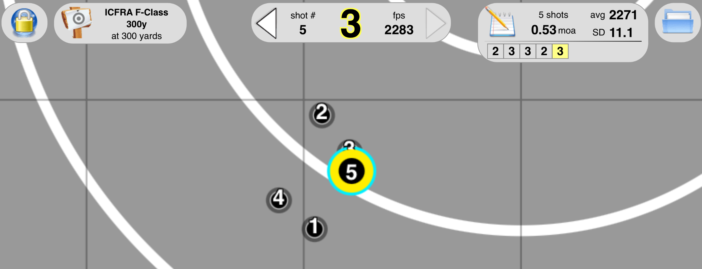
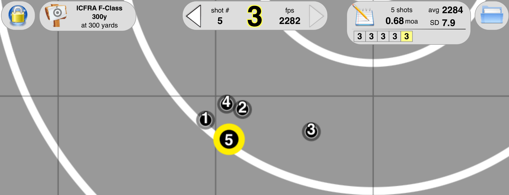
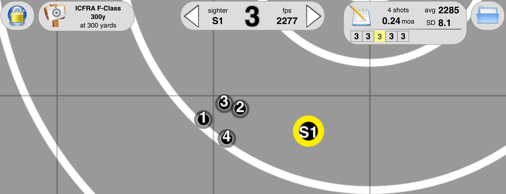
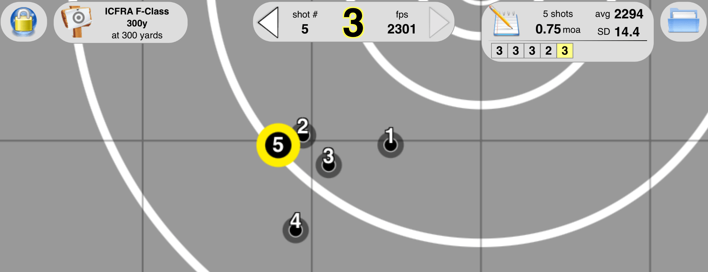

<!-- Dependencies -->

# Hand load 200.20X

### Summary
Initial load testing of 200.20X Berger with VihtaVuori N150. Used VihtaVuori reloading data
https://www.vihtavuori.com/reloading-data/rifle-reloading/?cartridge=30 to sample. 

### Initial Load

<!-- Table container -->

**Special notes:** The COAL below is greater than VihtaVuori's load data of 2.795". Max charge from VihtaVuori data is 40.3gr, but I tested to 44.4gr.

There were no pressure signs observed, and there is still plenty of case capacity.

Testing performed at 200 yards with 0 minutes of windage.

### Berger example ballistics data

| **Bullet Diameter**       | 0.308 inches | **Zero Range**      | 100 yards      |
|---------------------------|--------------|---------------------|----------------|
| **Bullet Weight**         | 200 grains   | **Sight Height**    | 1.50 in        |
| **Ballistic Coefficient** | 0.328        | **Muzzle Velocity** | 2650 fps       |
| **Temperature**           | 59 F         | **Wind Speed**      | 0.00 mph       |
| **Altitude**              | 0 feet       | **Wind Direction**  | 9 o'clock      |
| **Inclination**           | 0 degrees    | **Berger Bullets**  | Copyright 2013 |

<!-- Table container -->

Goal is for projectile to be above transonic speeds (1340-890fps) at 1000 yards for the best chance of a good group.

### Estimates of ladder charges using Gordons Reloading Tool
TBC

### Ladder testing - raw data

The VihtaVuori load data appears to be quite conservative maxing out at 40.6 which averages 2388fps. This doesn't yield enough velocity for FTR shooting. Initial ladder test was performed with a 2.2690" CBTO. Will move out closer to the lands when I perform group testing.

I ran all the way up to 44.4gr expecting to see pressure signs at around 43gr. 

No pressure signs were observed throughout all the testing, surprisingly. Ambient temperature was ~15°C with two minutes of pause left between each round.

#

No pressure signs were observed throughout this test. Cases and primers look same all the way through from lowest to highest charge.

### Group Testing

Not entirely happy with the results here. I was only able to shoot at 300 yards for this test, which differs from all other testing I've performed so far.

43.2, 43.5 and 43.8 show promise with all being said. Ignoring windage, the vertical spread for each was ~0.5 MOA. These also had a reasonable SD/ES.

#
<!-- Table container -->

Will need to load some more of these and test at 200 yards (to keep it the same as my other tests).

Will also look at smaller charge increments to see if I can squeeze some more out.

These were seated at 2.2690" CBTO (0.020" off the lands).

This was only testing a single box of 100, so I'll buy a larger quantity since these look like they could shoot well.

I'd definitely be looking to reach a 0.25 MOA grouping at 200 yards to be consistent with my 185gr rounds (these have proven to be a winner, since I have won some matches with these).

#

### Once fired brass

Nothing great about these groups. Best group was at 43.8, if we discount a flyer. Will need to experiment more with this load (seating depth and pointing). Having a 1:11 twist, and not full-bored for this head, I'm not sure how much better I'll get. Worst case, I'll keep these for when I get a new barrel.

All of the shots had a half value head wind of around 7mph, so not ideal for testing group sizes. Overall, they're not terrible considering these all had the same point of aim. Need further testing on 33.8gr and 44.1gr to verify. Will also need to validate seating depth to see if the groups improve.

No pressure signs were observed during this testing. Looks like the rounds sped up by around 20fps from new brass (same as the 185gr Juggernauts).

#
<!-- Table container -->

#### Screenshots

43.2gr had too much elevation.

43.5gr had too much elevation.

43.8gr had a good group, if we ignore the flyer to the right.

44.1gr had a good elevation spread if we ignore shot 4. Many things could have caused this flyer, so I can't ignore it. This is my first time resizing brass in my reloading journey, so there are a lot of variables that could affect this.

